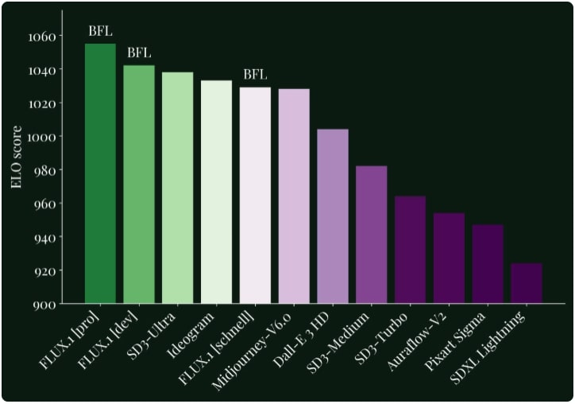
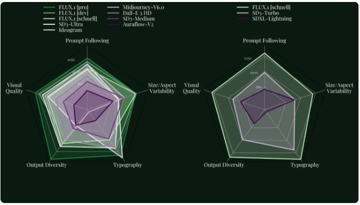
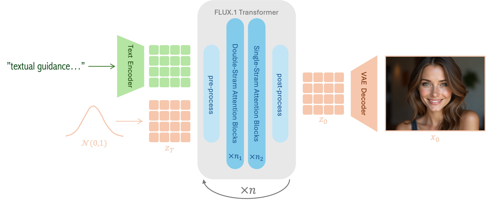
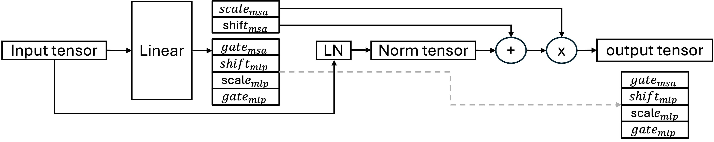
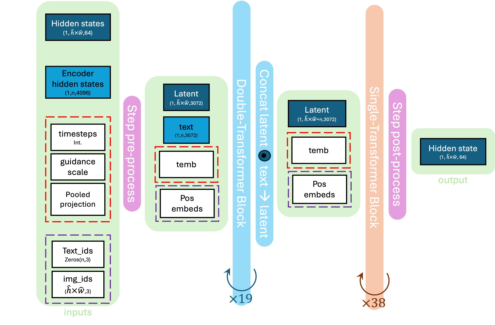
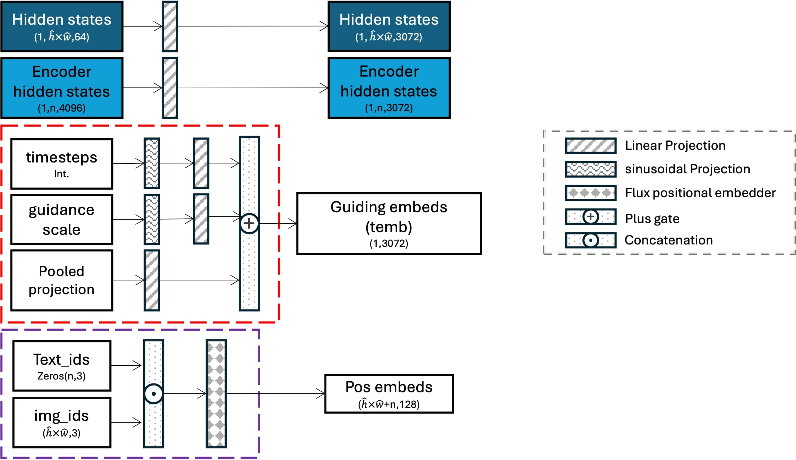
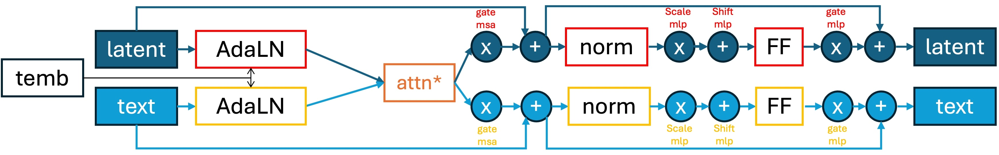
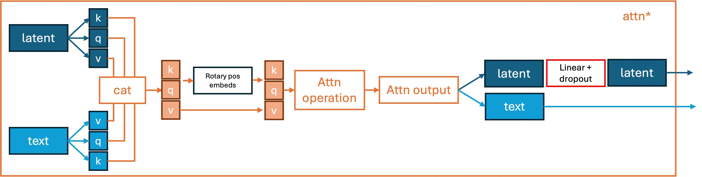
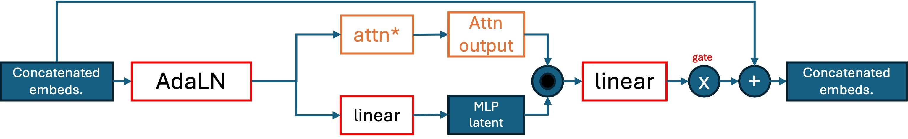
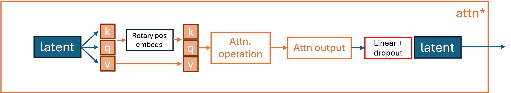

# FLUX.1 Architecture

## Introduction

**FLUX.1** [^flux2024] is a Rectified-Flow transformer trained in the latent space of an image encoder, introduced by **Black Forest Labs** in August 2024.

The FLUX.1 models (see [Section: Hub](#sec-hub)) demonstrate State-of-the-art (SoTA) performance for text-to-image tasks, in both terms of output quality and image-text alignment, as demonstrated in Figures [1](#figure-1) and [2](#figure-2) using the ELO-score metric, which ranks image generation models based on human preferences in head-to-head comparisons.

  
**Figure 1.** FLUX.1 defines a new state-of-the-art in image detail, prompt adherence, style diversity and scene complexity for text-to-image synthesis. Evaluation from [^FLUXAnnounce] 

 

  
**Figure 2**  ELO scores for different aspects: Prompt Following, Size/Aspect Variability, Typography, Output Diversity, Visual Quality. Evaluation from [^FLUXAnnounce]

 

While the model adheres to the Rectified Flow training paradigm (according to the developers statement), the exact details regarding the training setup —including the dataset, scheduling strategy, and hyperparameters— have not been publicly disclosed. However, the model’s architecture and inference scheme can be reverse-engineered from the publicly available inference code. 

In this section, we outline the model’s architecture to demystify its behavior at inference time. A top-view of the architecture is illustrated in Figure [3](#figure-3), where text embeddings and latent image embeddings are iteratively processed via a series of attention blocks. In the following section we deep-dive into the different components of the model.

  
**Figure 3.** High-level overview of the FLUX.1 architecture. Text embeddings and latent image embeddings are iteratively processed through a series of attention blocks to generate a text-conditioned image. 

 

In the following section we deep-dive into the different components of the model. We begin with a high-level overview of FLUX’s sampling pipeline in [FLUX.1 Sampling Pipeline](#pipeline-architecture), highlighting the key stages and the pre-trained components involved, followed by a deep-dive into the transformer's architecture in [Transformer](#transformer), where a detailed explanation is provided to the different stages and concepts used to construct it.

---

## Preliminaries  

In this section, we briefly describe some key pre-trained components and foundational concepts used in FLUX.1 along the sampling pipeline.

### CLIP Text Encoder

CLIP (Contrastive Language–Image Pretraining) [^radford2021learning] is a foundation model developed by OpenAI, designed to bridge vision and language understanding. CLIP's text-encoder transforms natural language prompts into class level or dense, high-dimensional embeddings that can be directly compared with image embeddings in a shared latent space. Trained on hundreds of millions of image–text pairs, the CLIP text encoder captures rich semantic information, enabling models to align textual descriptions with corresponding visual content effectively, making it widely used in text-to-image generation tasks.

### T5 Text Encoder

T5 (Text-To-Text Transfer Transformer) [^raffel2020exploring] is a versatile language model developed by Google that frames all NLP tasks—(e.g., translation, summarization, and question answering) as text-to-text problems. Its text encoder converts input text into contextualized embeddings using a Transformer-based architecture trained with a denoising objective over massive language corpora. Unlike CLIP’s text encoder, which is trained jointly with an image encoder to produce embeddings aligned with visual features for contrastive learning, T5 is trained purely on textual data and optimized for language understanding and generation. This makes T5 well-suited for providing rich, token-level semantic representations even for long and complext textual prompmts.

### Rotary Positional Embeddings

Rotary Positional Embeddings (RoPE) [^su2024roformer] are a method for injecting positional information into Transformer models by rotating the query and key vectors in multi-head self-attention according to their token positions. Unlike traditional sinusoidal or learned positional embeddings that are **added** to input tokens, RoPE applies a **rotation** in the complex plane that preserves relative positional relationships across sequences. This approach allows the model to generalize better to unseen sequence lengths and supports extrapolation beyond training data. RoPE has become popular in recent vision-language models, where understanding spatial relationships between tokens, especially when repurposing textual positions for image patches, is crucial.

### Adaptive Layer Normalization

Adaptive Layer Normalization (AdaLN) [^keddous2024vision] is a conditioning mechanism used in Transformer-based models [^nichol2021glide]  [^sauer2023stylegan] to modulate intermediate activations based on external input, such as text or image embeddings. Unlike standard Layer Normalization, which applies fixed scaling and shifting parameters, AdaLN dynamically generates these parameters as functions of a conditioning vector (see Figure [3](#figure-3)). This allows the model to adapt its behavior at each layer according to the input prompt or guidance signal.

  
**Figure 3** AdaLN layer, where MSA (Multi-head Self Attention) and MLP (Multi-Layer Processor) modulation parameters are computed based on the input tensor. In Single-Stream block (see \Cref{ssec:Single}), MLP modulation is not computed. 

 
---
 
## FLUX.1 Sampling Pipeline  

In this section, we describe the sampling pipeline of FLUX.1. For simplicity, we refer to the text-to-image sampling process as being conditioned on a single prompt per sample.

Similar to LDM [^rombach2022high], FLUX operates in a latent space, where the final latent output is decoded to reconstruct the RGB image in pixel space. Following LDM’s approach, the developers trained a convolutional autoencoder from scratch using an adversarial objective, but scaled up the latent representation from 4 channels (in LDM) to 16 channels.

The sampling pipeline consists of three phases: $$(1)$$ *Initiation and Pre-processing* $$(2)$$ *Iterative Refinement*, and $$(3)$$ *Post-processing*. An overview of these steps is illustrated in Figure [4]("figure-4"), where the notations follows the ones used in the official implementation of FLUX.1 pipeline in the *diffusers* [^diffusers2022] library.

  
**Figure 4** Flux pipeline: high-level overview. Just like in Difussion Models, after pre-processing the noisy latent $z_t$ (denoted *hidden\_state*$_t$) is being iteratively refined in the latent space, the final refined $$z_0$$ ($$=$$*hidden\_states*$$_0$$) is decoded into an RGB image using a pre-trained VAE decoder.

 

In the section below, we primarily focus on the *Initiation and Pre-processing* phase of the pipeline. A brief overview  of the *Iterative Refinement* and *Post-processing* phases is provided at the end of this section. The *Iterative Refinement* phase, in which the FLUX transformer operates, is discussed in detail in Section [Transformer]("Flux.1-Tranformer").

### Initiation and Pre-processing

 

In this phase, the model processes the user-provided inputs to prepare them for the main transformer’s refinement stage. A key component of this stage is the text encoder, which processes the textual guidance supplied by the user. FLUX.1 utilizes two pre-trained text encoders:

**CLIP Text Encoder.** 
CLIP (Contrastive Language–Image Pretraining) [^radford2021learning] is a foundation model developed by OpenAI, designed to bridge vision and language understanding. CLIP's text-encoder transforms natural language prompts into class level or dense, high-dimensional embeddings that can be directly compared with image embeddings in a shared latent space. Trained on hundreds of millions of image–text pairs, the CLIP text encoder captures rich semantic information, enabling models to align textual descriptions with corresponding visual content effectively, making it widely used in text-to-image generation tasks.

**T5 Text Encoder.** 
T5 (Text-To-Text Transfer Transformer) [^raffel2020exploring] is a versatile language model developed by Google that frames all NLP tasks (e.g., translation, summarization, and question answering) as text-to-text problems. Its text encoder converts input text into contextualized embeddings using a Transformer-based architecture trained over massive language corpora. Unlike CLIP’s text encoder, which is trained jointly with an image encoder to produce embeddings aligned with visual features for contrastive learning, T5 is trained purely on textual data and optimized for language understanding and generation. This makes T5 well-suited for providing rich, token-level semantic representations even for long and complex textual prompmts.

Below, we outline all the required inputs and describe how the model processes them in preparation for the refinement stage. The pipeline's inputs are:

- **text:** textual prompt guides the image generation process to enforce specified features or qualities.
- **guidance_scale:** controls the strength of conditioning.
- **num_inference_steps:** how many iterative sampling steps should be performed.
- **resolution:** Specifies the spatial resolution (height and width) of the generated image.

Once initiated with those inputs, they are being preprocessed as follows (notations are borrowed from the official implementation by *diffusers* [^diffusers2022]):

- **text:** The textual prompt is being encoded using two pre-trained text encoders:  
  - T5: provides dense (per token) embeddings, denoted *encoder hidden states*
  - CLIP: provides pooled embeddings (one embedding for the whole prompt, like CLS embedding), denoted *pooled projection*

- **num_inference_steps:** Specifies the total number of sampling steps used during inference. It determines a subset of timesteps from the full diffusion range $$t \in [0:T]$$, where typically $$T=1000$$. Iterating over these selected timesteps defines the sampling trajectory.

- **resolution:** The desired resolution determines the spatial dimensions of the initial (latent) noise sample $$z_0 \sim \mathcal{N}(0,1)$$. It is also used to define the *img_ids* — a set of per-token indicators, pointing at the token's spatial location on a 2D grid. Given a target resolution $$(H,W)$$ in pixel space, the corresponding latent dimensions $$(h,w)$$ are computed as $$h = \lfloor H / \text{VAE_scale} \rfloor$$ and $$w = \lfloor W / \text{VAE_scale} \rfloor$$ where $$\text{VAE_scale}=8$$.  
The image-token grid is further downsampled to dimensions $$(h//2, w//2)$$, and each token is assigned a unique identifier of the form $$(t, \hat{h}, \hat{w})$$, where $$\hat{h} \in [0:h-1]$$ and $$\hat{w} \in [0:w-1]$$, indicating the token’s location on a 2D spatial grid.  
*text_ids* are initiated using the same structure of *img_ids*, but with $$t = h = w = 0$$ for all tokens. Formally, $$\text{text_ids} = n \cdot (0,0,0)$$ where $$n$$ is the maximal number of tokens in T5 (512).

### Iterative Refinement and Post-processing

Let $$\Phi = [\text{encoder_hidden_states}, \text{pooled_projection}, \text{guidance}, \text{img_ids}, \text{text_ids}]$$ be a set the pre-processed pipeline's inputs. Same as in Diffusion Models, $$[z_t, t, \Phi]$$ are iteratively fed into the transformer during inference sampling, such that:

$$
\forall t \in \text{timesteps}: \quad z_{t+\Delta t} = \text{Samp}\bigl(v_\theta(z_t, t, \Phi)\bigr)
$$

Where $$v_\theta$$ is the trainable network that estimates the velocity vector (see [Rectified Flow](#rectified-flows)) and $$\text{Samp}(\cdot)$$ refers to the Flow-Matching Euler Discrete sampler [^lipman2022flow]. Pay attention to the notation that differs from the one used in Diffusion Models. Here timesteps range between $$0$$ and $$1$$, with $$z_1$$ the clear image and $$z_0$$ the pure Gaussian noise. In Section [Transformer]("Flux.1-Tranformer") we explore the architecture of $$v_\theta$$.

After the iterative refinement, the final clean latent $$z_1$$ is decoded via pre-trained *VAE* model to get the final image $$x_1$$. 
 

## Transformer

The core component of FLUX.1’s synthesis pipeline is the velocity predictor $$v_\theta$$, which is optimized to estimate the velocity vector along the sampling trajectory (see Section [Rectified Flows](#rectified-flows)). Similar to SD3 [^esser2024scaling], FLUX.1 replaces the conventional *U-Net* architecture with a ffully transformer-based design. A high-level overview of the transformer’s operations at each sampling step is provided in Figure [5]("figure-5"). In this section, we describe the primary building blocks that constitute this transformer architecture.

**Figure 5** Flux Transformer: high-level overview

 

### Step Pre-Process

Along the sampling trajectory, the transformer runs multiple times, once for each sampling step, where each run uses different parameters: 

- The guiding parameter **timestep** is iterated from the pre-calculated list of values between **1** to **0**.
- **hidden_state** (mostly referred to as $$z_t$$) is the latent representation which is iteratively refined from Gaussian noise into a clear image. It is updated along the sampling trajectory.

**Figure 6** Flux Transformer: per-step inputs preprocess

 

As a result, the transformer pre-processes its inputs internally as described in Figure [6]("figure-6"). Formally, the following steps are taken:

- use of per-domain linear layers to bring the latent embeddings and dense-prompt-embeddings (T5) into a shared dimensionality of 3072 features per token. 
- construction of guiding embeds. Unlike Diffusion Models, that encode only the "temporal" information (i.e, timestep) in this phase, FLUX.1 uses both the timestep and the pooled prompt embeds (from CLIP) as guiding embeddings, yet keeps the traditional notation **temb**. It uses sinusoidal projection (as in [^ho2020denoising]) to embed the integer values of the timestep and guidance, than applies dedicated linear projection layers to each component to bring them to the shared dimensionality of 3072 features. Finally, the 3 projected embeddings are summed to create the final **temb** (marked in a red block in Figure [6]("figure-6")).
- The **img_ids** and **text_ids** (see Section [Pipeline Architecture](#pipeline-architecture)) are concatenated, than used to extract per-token positional embeds. To extract positional embeddings from 3D token indices (t,h,w), each axis is first converted to a continuous embedding using axis-specific sinusoidal frequencies scaled by a constant $$\theta$$. TThe cosine and sine of the resulting frequency-position products are computed and interleaved to form real-valued vectors. These are then concatenated across all axes to produce the final positional embedding as a pair of tensors (cosine and sine), ready to be used in rotary positional encoding (the process os composed in the purple block in Figure [6]("figure-6")). Note that this process is not influenced by **timestep** nor **hidden_states**, hence the **pos_embeds** are constant across different sampling steps.

The **pos_embeds** and **temb** parameters are used to support the attention mechanism along the step, while **hidden_states** and **encoder_hidden_states** are processed and refined along the step.

---
 
### Double Transformer Block

After preprocess, a series of 19 Double-Transformer blocks are applied. Those blocks employ seperate weights for image and text tokens (see Figure [7a]("figure-7a")). Multi-modality is achieved by applying the attention operation over the concatenation of the tokens (see Figure [7b]("figure-7b")).

 

**Figure 7a.** Double-Attention Block: latent and prompt embeddings are processed separately, in a standard attention scheme.

 

**Figure 7b.** The attention operation is applied over the concatenation of the tokens.

 

Each stream (latent and prompt) uses AdaLN layers for normalization and modulation (see Figure [3]("figure-3")). The normalized tensors are used to extract the $$K$$, $$Q$$, and $$V$$ matrices for each domain, which are then concatenated for mixed attention. The concatenated $$K$$ and $$Q$$ matrices are rotated using precomputed rotary positional embeddings (pos_embeds) and passed through the mixed attention operation. The outputs are separated back into their respective streams and alpha-blended with the residual input using the $$gate_{\text{msa}}$$ parameter extracted by the AdaLN layer. The results are further normalized via a LayerNorm ($$LN$$) layer and modulated using the $$scale_{\text{mlp}}$$ and $$shift_{\text{mlp}}$$ parameters, also extracted by the AdaLN layer, before being passed to the feedforward layer. Finally, the output is alpha-blended with the unnormalized input using the $$gate_{\text{mlp}}$$ parameter from the AdaLN layer. The entire process is illustrated in Figure [7a]("figure-7a").

---
 
### Single Transformer Block  

After the series of Double-Stream blocks is applied, the processed latent and prompt embeddings are concatenated and fed through a series of Single-Stream blocks.

While the Double-Stream blocks apply different weights for prompt and latent embeddings, the Single-Stream blocks use a single set of weights to process a concatenated tensor or latent and text embeddings (see Figure 4). In addition, the Single-Stream blocks replace the standard sequential attention block (where an MLP, like Feed-Forward, is applied after the attention step), with a parallel mechanism where the attention block and an MLP are computed simultaneously from the same input.

  

**Figure 8a.** Single-Attention Block: latent and prompt embeddings are processed together, in a simultaneous attention scheme.

 

**Figure 8b.** The $$K$$, $$Q$$ and $$V$$ metrices are computed directly from the concatenated representation.

 

---
 
### Comparison Between Double-Stream and Single-Stream Blocks

A comparison between the Double-Stream and Single-Stream blocks is provided in Table [1]("table-1"):

| Property           | Double-Stream Block                                                                 | Single-Stream Block                                                           |
|--------------------|------------------------------------------------------------------------------------|-------------------------------------------------------------------------------|
| **Weight Sharing**  | Uses separate weights for text and latent tokens in both attention and feedforward layers. | Uses shared weights for both text and latent tokens across attention and feedforward layers. |
| **Parallel Attention** | Parallel attention is used on concatenated latent and prompt embeddings.        | Parallel attention is used on concatenated latent and prompt embeddings.      |
| **Computation Style**  | Attention and feedforward (MLP) layers are applied sequentially, where the attention's output defines the feedforward's input. | Attention and feedforward layers are computed in parallel using the same input for both. |

**Table 1:** Comparison between Double-Stream and Single-Stream blocks in FLUX.1

 

Specifically, the Double-Stream and Single-Stream blocks differ in two main attributes: weight sharing between text and latent tokens (shared vs. not shared), and computation style (sequential vs. parallel). While the exact motivation behind the FLUX authors' choice of this specific architecture is not documented, the following is a brief comparison of these attributes, highlighting the possible pros and cons of each, potentially shedding light on the reasoning behind including both block types in FLUX.1's architecture.

**Weight Sharing (Shared vs. Not Shared)**

Weight sharing refers to whether the same attention and feedforward parameters are used for both text and latent tokens. In the Single-Stream block, shared weights enable more efficient parameter usage and promote tighter integration between modalities, which may help the model generalize better across domains. However, this comes at the cost of reduced flexibility, as both token types must be processed identically despite potentially having very different characteristics. In contrast, the Double-Stream block avoids weight sharing, allowing the model to specialize its representations for text and latent tokens independently. This specialization can improve performance when domain-specific distinctions are critical, though it increases model size and computational overhead. The inclusion of both strategies in FLUX.1 suggests a deliberate balance between efficiency and specialization.

**Computation Style (Sequential vs. Parallel)**

The key distinction in computation style lies in how the attention and feedforward (MLP) layers are applied within a block. In the Double-Stream block, the computation is sequential: the input is first normalized, passed through an attention layer, then normalized again before being fed into the feedforward layer. This means the output of the attention block defines the input to the MLP feedforward, enabling tightly coupled, stage-wise processing that allows each layer to build upon the previous one. In contrast, the Single-Stream block follows a parallel design. The input is normalized once, and the resulting representation is simultaneously passed through both the attention and MLP layers independently. Their outputs are then combined downstream. This parallelism increases efficiency and allows for broader representation capacity per block, but it may limit the depth of inter-layer interaction present in sequential designs. FLUX.1's use of both may reflect a trade-off between expressive sequential processing and the speed or simplicity of parallel computation.

---
 
In summary, Single-Stream blocks emphasize efficiency and simplicity through parallel computation and shared weights, while Double-Stream blocks favor specialization and expressiveness with sequential flow and separate weights. While the Double-Stream blocks follow the *mm-DiT* design previously used in *SD3* [^esser2024scaling], the addition of Single-Stream blocks may reflect the FLUX authors’ intention to expand the model’s capacity in a relatively lightweight and efficient manner.

 
---
 
## References
[^flux2024]: FLUX.1 paper, Black Forest Labs (2024).  
[^radford2021learning]: Radford et al., “Learning Transferable Visual Models From Natural Language Supervision”, OpenAI (2021).  
[^raffel2020exploring]: Raffel et al., “Exploring the Limits of Transfer Learning with a Unified Text-to-Text Transformer”, JMLR (2020).  
[^su2024roformer]: Su et al., “RoFormer: Enhanced Transformer with Rotary Position Embedding”, (2024).  
[^keddous2024vision]: Keddous et al., “Vision transformers inference acceleration based on adaptive layer normalization”, (2024).  
[^nichol2021glide]: Nichol et al., “GLIDE: Towards Photorealistic Image Generation and Editing with Text-Guided Diffusion Models”, OpenAI (2021).  
[^sauer2023stylegan]: Sauer et al., “StyleGAN-T: Unlocking the Power of GANs for Fast, High-Resolution Text-to-Image Synthesis”, (2023).
[^ho2020denoising]: Ho, Jonathan, Ajay Jain, and Pieter Abbeel. "Denoising diffusion probabilistic models." (2020).
[^FLUXAnnounce]: [Black-Forest-Labs official FLUX.1 announcement](https://bfl.ai/announcements/24-08-01-bfl), (2024). 
[^rombach2022high]:Rombach, Robin, et al. "High-resolution image synthesis with latent diffusion models." (2022).
[^esser2024scaling]: Esser, Patrick, et al. "Scaling rectified flow transformers for high-resolution image synthesis." (2024).
[^diffusers2022]: Von Platen, Patrick and Patil, Suraj et al., ["Diffusers: State-of-the-art diffusion models"][(https://github.com/huggingface/diffusers) (2022) 
[]‏
‏
